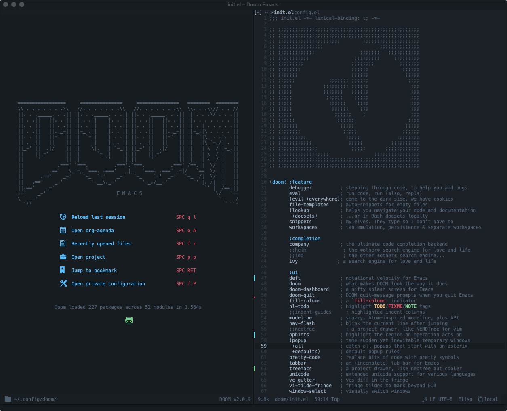

# v.doom.d

A fork of @hlissner's [private module](https://github.com/hlissner/doom-emacs-private) for the excellent [doom-emacs](https://github.com/hlissner/doom-emacs).



```
git clone git@github.com:Vvkmnn/v.doom.d.git ~/.config/doom/
ln -s ~/.config/doom/ ~/.v.doom.d 
```
