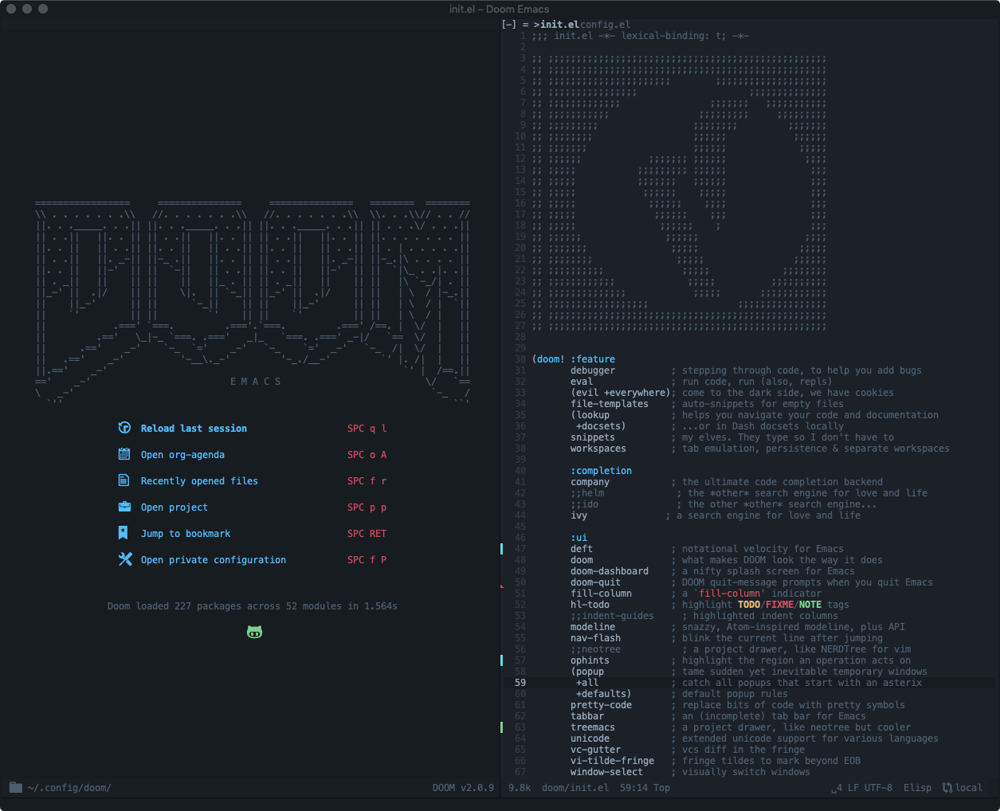

# v.doom.d

A fork of @hlissner's [private module](https://github.com/hlissner/doom-emacs-private) for the excellent [doom-emacs](https://github.com/hlissner/doom-emacs).



```
git clone git@github.com:Vvkmnn/v.doom.d.git ~/.config/doom/
ln -s ~/.config/doom/ ~/.v.doom.d

# brew
brew install emacs-plus --with-debug --with-xwidgets --with-imagemagick --with-mailutils --with-dbus --with-modern-doom3-icon

## parinfer
# https://github.com/justinbarclay/parinfer-rust-mode/issues/43#issuecomment-1054303553
git clone https://github.com/eraserhd/parinfer-rust.git
cargo build --release --features emacs
cp target/release/libparinfer_rust.dylib ~/.emacs.d/.local/etc/parinfer-rust/parinfer-rust-darwin.so
```
